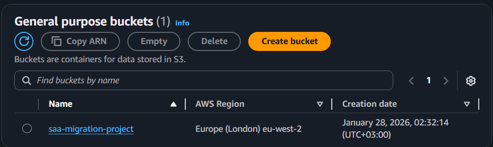
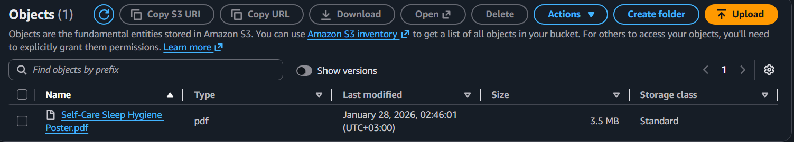
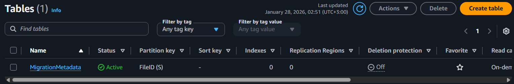
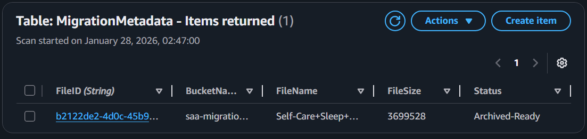
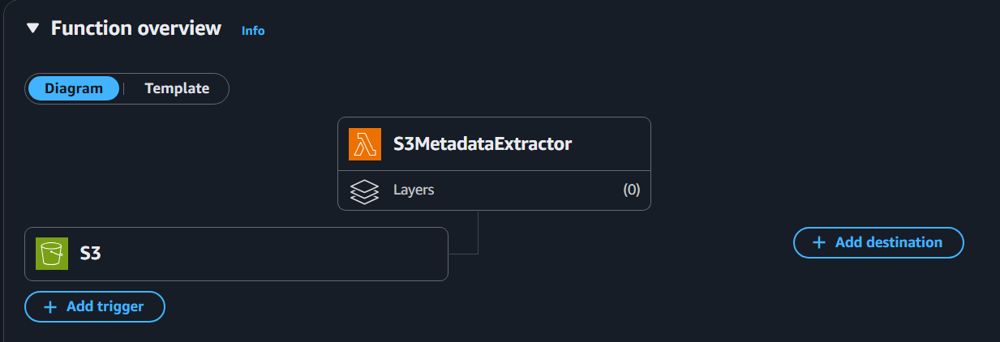
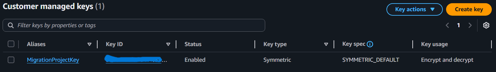

# AWS-Hybrid-Data-Migration-Archival-Pipeline

Bu proje, on-premise bir sunucudan AWS bulutuna veri taşıma sürecini simüle eden, **AWS Solution Architect (SAA)** prensipleriyle tasarlanmış bir mimaridir. 

## Mimari Şema

## Mimari Bileşenler & Kararlar
- **Amazon S3:** Veri gölü (Data Lake) olarak kullanıldı. SSE-KMS ile şifrelendi.
- **AWS Lambda:** Event-driven mimari için tercih edildi. S3'e dosya geldiği an asenkron olarak tetiklenir.
- **Amazon DynamoDB:** Dosya metadata'larını (boyut, zaman, durum) saklamak için kullanıldı.
- **S3 Lifecycle Policies:** Maliyet optimizasyonu için veriler 30 gün sonra otomatik olarak Glacier katmanına taşınır.

## Manuel Kurulum Rehberi (AWS Console)
Bu proje Terraform kullanmadan, tamamen AWS Management Console üzerinden yapılandırılmıştır.
1. **KMS:** `MigrationKey` adında bir simetrik anahtar oluşturuldu.
2. **S3:** Bucket oluşturulurken "Versioning" ve "KMS Encryption" aktif edildi.
3. **IAM:** Lambda'nın S3 ve DynamoDB'ye erişebilmesi için `Least Privilege` prensibiyle bir Role tanımlandı.
4. **Lambda:** Python 3.x çalışma ortamı ile kural oluşturulup S3 Trigger eklendi.

## İzleme ve Kayıt
Süreçlerin başarısı **Amazon CloudWatch** logları üzerinden ve **DynamoDB** tablosundaki kayıtlar incelenerek doğrulanmıştır.

